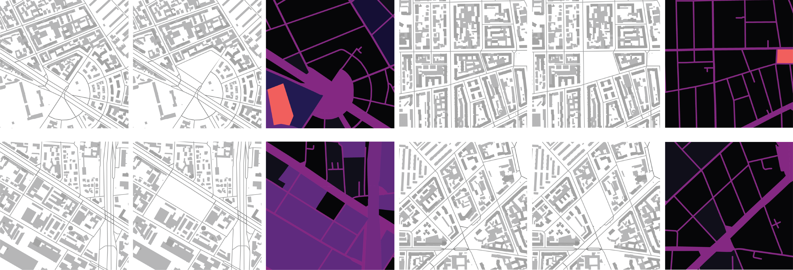

## Urban Datasets Generator

This script is intended to be used inside <a href="https://www.qgis.org/en/site/">QGIS Software</a> to create an image urban datasets. The contents of the images can vary based on the shapefiles available to you:)



_These images were created using the script presented in this repo. The data were taken from_ <a href="https://dati.comune.milano.it/">_Comune di Milano_</a>.

### How To Use

1. Open QGIS
2. Upload your shapefiles and style them according to your needs
3. Go to ```Plugins -> Python Console```
4. NAvigate to ```city_generator.py``` and choose it
5. Set the variables:
* SAMPLES - number of images to generate
* BASE_PATH - path to save the images to
6. Change the variable trainA to True if you need to generate both the normal set and the set with a central block painted in white.
7. Set the variable EXTRA to True if ou want to generate annotations of building density and green density. Make sure to provide the name of the green layer!
8. To adapt the files to pix2pix:
```
$python change_dim.py FOLDER [--folder1 FOLDER1] [--concat 1]
```
* FOLDER - path to the folder with the images (trainB)
* folder1 - path to the second folder with the images (trainA) optional
* concat - an option to concat two images together, the output will be stored in trainAB
9. Enjoy!

### Images only for some specific blocks

You can also generate images just for some specific blocks. Make sure they are on a separate layer and  provide your layer name as the ```interest_layer``` in the end of the script file. If you want to generate images in one specific region only (e.g. city center), make a separate layer with a polygon delimiting this zone and add the name of this layer as ```region_layer``` in the end of the script file.

### What if I don't have any shapefiles?

Don't worry! There is a script that gets the shapefiles from the region you need directly from <a href="https://www.openstreetmap.org/">OpenStreetMap</a> data <a href="https://opendatacommons.org/licenses/odbl/">(OdBL license)</a>. The script will make one shapefile with the roads and one with the buildings. Find a good location for your dataset and follow the steps:

1. Install <a href="https://www.anaconda.com/products/individual">Conda</a>
2. Install <a href="https://osmnx.readthedocs.io/en/stable/">osmnx</a> package in a new environment named osm

```
$conda config --prepend channels conda-forge
$conda create -n osm --strict-channel-priority osmnx
```
  
3. Activate the environment:
```
$conda activate osm
```
  
4. Run the script, placing the name of your geographical location inside (make sure it corresponds to osm naming and query):
```
$python get_shapefiles.py "City, Country"
```
If you do not need the whole city shapefile to be downloaded you can specify just one zone:
```
$python get_shapefiles.py "Zone, City, Country"
```
Example:
```
$python get_shapefiles.py "Bovisa, Milan, Italy"
```

### Metrics calculation

To calculate metrics:
```
$python metrics.py images_folder
```
images_folder should contain concatenated images (A+B).
